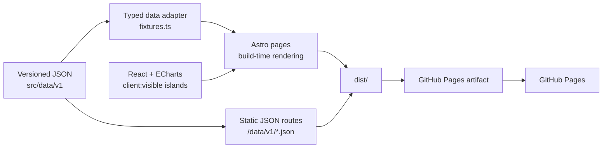

# Ayutthaya Education Data Portal

ศูนย์ข้อมูลการศึกษาจังหวัดพระนครศรีอยุธยา — เว็บไซต์สถิติการศึกษาแบบ responsive สำหรับสำรวจภาพรวม เปรียบเทียบรายอำเภอ ตรวจสอบแนวโน้ม และดาวน์โหลดข้อมูลในรูปแบบ JSON

โครงการนี้ออกแบบให้มีบุคลิกแบบ modern government analytics platform: ใช้พื้นที่อย่างเป็นระบบ สีสันจำกัด การ์ดและตารางที่อ่านง่าย กราฟระดับงานองค์กร และแสดงแหล่งที่มา/รอบข้อมูลควบคู่กับตัวชี้วัดสำคัญ

> **สถานะ:** พร้อม build และเผยแพร่เป็น static site ผ่าน GitHub Pages ข้อมูลในเวอร์ชันปัจจุบันถอดจากรายงานสถิติจังหวัดพระนครศรีอยุธยา พ.ศ. 2568 และควรตรวจยืนยันกับหน่วยงานเจ้าของข้อมูลก่อนใช้ในการตัดสินใจที่มีผลกระทบสูง

## คุณสมบัติหลัก

- Dashboard ภาษาไทยที่รองรับ desktop, tablet และ mobile
- ตัวชี้วัดระดับจังหวัดและข้อมูลครบ 16 อำเภอ
- หน้าการศึกษาสังกัดองค์กรปกครองส่วนท้องถิ่น พร้อมข้อมูลทรัพยากรและผู้เรียนรายอำเภอ
- พจนานุกรมข้อมูลที่ระบุนิยาม หน่วย สูตร และเงื่อนไขการเปรียบเทียบ
- รวมลิงก์เว็บไซต์ข้อมูลการศึกษาและแหล่งเรียนรู้ที่เกี่ยวข้องของจังหวัด
- กราฟ Apache ECharts แบบโต้ตอบและใช้ SVG renderer
- ตารางข้อมูลที่เลื่อนแนวนอนได้โดยไม่ทำให้หน้า mobile overflow
- ชุดข้อมูล JSON แบบ versioned พร้อม manifest และ metadata
- การตรวจยอดรวมและยอดย่อยอัตโนมัติก่อน build
- แสดงรอบข้อมูล หน่วย ตารางต้นทาง และข้อจำกัดด้านคุณภาพข้อมูล
- รองรับ GitHub Pages ทั้ง root domain และ repository subpath
- GitHub Actions สำหรับ validate, build และ deploy อัตโนมัติ
- Custom 404 page และ navigation ที่ใช้งานด้วยแป้นพิมพ์

## หน้าภายในเว็บไซต์

| Route | เนื้อหา |
| --- | --- |
| `/` | ภาพรวมจังหวัด ตัวชี้วัดหลัก และแนวโน้ม |
| `/districts` | เปรียบเทียบสถานศึกษา ห้องเรียน ครู และนักเรียนครบ 16 อำเภอ |
| `/schools` | โรงเรียนและห้องเรียน แยกตามสังกัดและพื้นที่ |
| `/students` | นักเรียนตามระดับ ชั้น เพศ และแนวโน้ม 5 ปี |
| `/teachers` | ครูตามคุณวุฒิ ระดับที่สอน เพศ และแนวโน้ม |
| `/access-and-dropout` | แนวโน้มและสาเหตุการออกกลางคัน |
| `/higher-education` | อาชีวศึกษาและอุดมศึกษา |
| `/lifelong-learning` | การศึกษานอกระบบและการเรียนรู้ตลอดชีวิต |
| `/local-education` | การศึกษาสังกัดองค์กรปกครองส่วนท้องถิ่น แยกรายอำเภอ ระดับ และเพศ |
| `/data` | บัญชีชุดข้อมูลและ JSON downloads |
| `/definitions` | พจนานุกรมข้อมูล หน่วย สูตร และข้อควรระวังในการเปรียบเทียบ |
| `/methodology` | นิยาม วิธีคำนวณ แหล่งข้อมูล และข้อจำกัด |
| `/about` | วัตถุประสงค์ กลุ่มผู้ใช้ และหลักการออกแบบ |
| `/404.html` | หน้าสำหรับ URL ที่ไม่พบ |

## เทคโนโลยี

| ส่วน | เทคโนโลยี | เหตุผล |
| --- | --- | --- |
| Static site generator | Astro 7 | สร้าง HTML ล่วงหน้า เหมาะกับ GitHub Pages และลด JavaScript ที่ไม่จำเป็น |
| Interactive islands | React 19 | ใช้เฉพาะองค์ประกอบที่ต้องทำงานใน browser |
| Charts | Apache ECharts 6 | กราฟแบบโต้ตอบ รองรับ ARIA และ SVG |
| Language | TypeScript 6 | ตรวจชนิดข้อมูลของ component และ chart options |
| Styling | CSS tokens + scoped CSS | ควบคุม design system โดยไม่พึ่ง Bootstrap |
| Package manager | pnpm 11 | ติดตั้ง dependency ตาม lockfile อย่างทำซ้ำได้ |
| Hosting | GitHub Pages | รองรับ static hosting และ deployment ผ่าน GitHub Actions |

Dependency ทุกตัวกำหนดเวอร์ชันแบบ exact ใน `package.json` และ workflow actions ถูก pin ด้วย full commit SHA

## สถาปัตยกรรม



### การตัดสินใจสำคัญ

- **Static-first:** หน้าและข้อมูลถูกสร้างล่วงหน้า ไม่มี server runtime หรือฐานข้อมูลที่ต้องดูแล
- **Single source of truth:** Dashboard และ JSON downloads อ่านค่าจาก `src/data/v1/` ชุดเดียวกัน
- **Progressive enhancement:** เนื้อหา ตาราง และ navigation ใช้งานได้จาก HTML; React โหลดเฉพาะกราฟเมื่อเข้าใกล้ viewport
- **Versioned data contract:** ทุกชุดมี `schemaVersion`, `datasetId`, period, unit และ source table
- **Base-path safe:** URL ภายในผ่าน `withBase()` และ workflow อ่าน subpath จาก GitHub Pages อัตโนมัติ
- **Transparent uncertainty:** ข้อสังเกตจากเอกสารต้นทางถูกเก็บใน `dataQuality` และหน้า methodology แทนการแก้ตัวเลขโดยไม่มีหลักฐาน

## เริ่มต้นใช้งาน

### ความต้องการของระบบ

- Node.js 24 แนะนำสำหรับให้ตรงกับ CI
- Corepack
- Git

### ติดตั้ง

```bash
corepack enable
pnpm install --frozen-lockfile
```

### เปิด development server

```bash
pnpm run dev
```

จากนั้นเปิด `http://localhost:4321`

### ตรวจสอบและ build

```bash
pnpm run validate:data
pnpm run check
pnpm run build
pnpm run preview
```

ไฟล์ผลลัพธ์จะอยู่ใน `dist/`

## คำสั่งที่มีให้ใช้

| คำสั่ง | หน้าที่ |
| --- | --- |
| `pnpm run dev` | เปิด Astro development server |
| `pnpm run check` | ตรวจ Astro และ TypeScript diagnostics |
| `pnpm run validate:data` | ตรวจ schema version, จำนวนระเบียน, ยอดรวม และยอดย่อย |
| `pnpm run build` | ตรวจ type แล้วสร้าง static site |
| `pnpm run preview` | เปิด preview จาก production build |

## ตัวแปรสภาพแวดล้อม

| Variable | ค่า local เริ่มต้น | ความหมาย |
| --- | --- | --- |
| `PUBLIC_SITE_URL` | `https://example.github.io` | Origin สำหรับ canonical site configuration |
| `PUBLIC_BASE_PATH` | `/` | Path นำหน้าสำหรับ project site เช่น `/repository-name` |

ดูตัวอย่างที่ `.env.example` ตัวแปรทั้งสองเป็น public build configuration ไม่ควรใช้เก็บ secret

ทดสอบ GitHub Pages subpath ในเครื่องได้ด้วย:

```bash
PUBLIC_SITE_URL=https://OWNER.github.io \
PUBLIC_BASE_PATH=/REPOSITORY \
pnpm run build
```

## โครงสร้างโครงการ

```text
.
├── .github/workflows/
│   └── deploy-pages.yml        # Validate, build และ deploy
├── docs/
│   └── DEPLOYMENT.md           # คู่มือเผยแพร่และดูแลระบบ
├── scripts/
│   └── validate-data.mjs       # Cross-dataset validation
├── src/
│   ├── components/
│   │   ├── brand/
│   │   ├── charts/
│   │   ├── dashboard/
│   │   ├── data-display/
│   │   ├── foundation/
│   │   └── navigation/
│   ├── data/
│   │   ├── fixtures.ts         # Compatibility adapter สำหรับหน้าเว็บ
│   │   └── v1/                 # Canonical JSON datasets
│   ├── layouts/
│   ├── lib/
│   ├── pages/                  # Astro pages และ JSON endpoints
│   └── styles/
├── astro.config.mjs
├── package.json
└── pnpm-lock.yaml
```

`dist/`, `node_modules/` และ `.astro/` เป็นไฟล์ที่สร้างอัตโนมัติและไม่ควร commit

## ชุดข้อมูล JSON

Manifest หลักอยู่ที่ `src/data/v1/manifest.json` และเผยแพร่เป็น `/data/v1/manifest.json`

| Dataset ID | Endpoint | ขอบเขต | รอบข้อมูล | ตารางต้นทาง |
| --- | --- | --- | --- | --- |
| `overview` | `/data/v1/overview.json` | จังหวัด | ปีการศึกษา 2567 และแนวโน้ม 2563–2567 | 3.1, 3.10, 7.4 |
| `districts` | `/data/v1/districts.json` | 16 อำเภอ | ปีการศึกษา 2567 | 3.2 |
| `students` | `/data/v1/students.json` | จังหวัด | ปีการศึกษา 2567 และแนวโน้ม 2563–2567 | 3.3–3.5, 7.4 |
| `teachers` | `/data/v1/teachers.json` | จังหวัด | ปีการศึกษา 2567 และแนวโน้ม 2563–2567 | 3.6–3.9, 7.4 |
| `dropout` | `/data/v1/dropout.json` | จังหวัด | ปีการศึกษา 2558–2567 | 3.11–3.12 |
| `postsecondary` | `/data/v1/postsecondary.json` | จังหวัด | ปีการศึกษา 2567 | 3.13–3.14 |
| `lifelong-learning` | `/data/v1/lifelong-learning.json` | จังหวัด | ปีงบประมาณ 2567 | 3.15–3.16 |
| `local-education` | `/data/v1/local-education.json` | 16 อำเภอ / กลุ่มสังกัดท้องถิ่น | ปีการศึกษา 2567 | 3.1, 3.3, 3.5, 3.7, 3.8 |
| `definitions` | `/data/v1/definitions.json` | ชุดข้อมูลเว็บไซต์เวอร์ชัน 1 | หลายรอบข้อมูล | 3.1–3.16, 7.4 |

### หลักการของ data contract

- รหัส เช่น `districtCode`, `gradeId` และ dataset ID ต้องคงที่ข้ามรอบข้อมูล
- ตัวเลขเก็บเป็น JSON number ไม่ใช่ข้อความที่มี comma
- ค่าที่ไม่มีในต้นทางใช้ `null` พร้อมหมายเหตุ ไม่แทนด้วย `0`
- ชื่อ field ใช้ภาษาอังกฤษ; label ที่แสดงผลใช้ suffix `Th`
- ปี พ.ศ. และ ค.ศ. แยกเป็น field ชัดเจนเมื่อมีทั้งสองค่า
- `schemaVersion` ใช้ semantic versioning; เพิ่ม major เมื่อ breaking change
- ประเด็นที่ต้องระวังบันทึกใน `dataQuality`

### การปรับปรุงข้อมูล

1. ถอดข้อมูลจากแหล่งต้นทางและบันทึกหน่วย/รอบเวลา
2. แก้ JSON ที่เกี่ยวข้องใน `src/data/v1/`
3. ปรับ manifest เมื่อเพิ่มชุดข้อมูล เปลี่ยนรอบ หรือเปลี่ยนสถานะ
4. ปรับ `src/data/fixtures.ts` เฉพาะเมื่อ data shape ที่หน้าเว็บใช้เปลี่ยน
5. รัน `pnpm run validate:data`
6. รัน `pnpm run build` และตรวจทุกหน้าที่ได้รับผลกระทบ
7. บันทึกข้อจำกัดในหน้า methodology และ `dataQuality`

หากเพิ่ม dataset ใหม่ ต้องเพิ่ม import ใน `src/pages/data/v1/[dataset].json.ts` และเพิ่มรายการใน manifest เพื่อให้มี endpoint และลิงก์ดาวน์โหลด

## การตรวจคุณภาพ

`scripts/validate-data.mjs` ตรวจอย่างน้อย:

- Schema version และจำนวน dataset ใน manifest
- จำนวนอำเภอ
- ผลรวมสถานศึกษา ห้องเรียน ครู และนักเรียนรายอำเภอเทียบยอดจังหวัด
- ผลรวมผู้เรียนตามระดับ
- ผลรวมชายและหญิงเทียบยอดรวมในระดับและชั้นเรียน
- ผลรวมครูตามคุณวุฒิและระดับที่สอน
- ผลรวมสาเหตุการออกกลางคัน
- ผลรวมเพศของอาชีวศึกษาและอุดมศึกษา
- ผลรวมสถานศึกษา ห้องเรียน ครู นักเรียน ระดับ ชั้น และเพศของกลุ่มสังกัดท้องถิ่น
- ความครบถ้วนและรหัสไม่ซ้ำของพจนานุกรมข้อมูล

CI จะหยุด deployment ทันทีเมื่อ validation หรือ build ไม่ผ่าน

ก่อน merge การเปลี่ยนแปลงด้าน UI ควรตรวจเพิ่ม:

- หน้าจอ desktop ประมาณ 1440 px
- หน้าจอ mobile ประมาณ 390 px
- ไม่มี page-level horizontal overflow
- ตารางกว้างเลื่อนภายใน container ได้
- Mobile navigation เปิด ปิด และปิดด้วยปุ่ม Escape ได้
- Browser console ไม่มี error
- กราฟมีชื่อที่อธิบายข้อมูลและมีตารางทางเลือกในจุดที่เหมาะสม

## Accessibility

- กำหนดภาษาเอกสารเป็นภาษาไทย
- มี skip link ไปยังเนื้อหาหลัก
- ใช้ landmark, heading, breadcrumb และ `aria-current` อย่างเป็นระบบ
- Mobile drawer มี label, backdrop และรองรับ Escape
- ตารางมี caption และ container ที่ keyboard focus ได้
- กราฟใช้ `role="img"`, accessible label และ ECharts ARIA component
- สีไม่ได้เป็นตัวสื่อความหมายเพียงอย่างเดียวในข้อความสถานะสำคัญ
- รองรับ responsive layout โดยไม่ซ่อนข้อมูลหลัก

การเปลี่ยนสีหรือ typography ควรรักษา contrast, focus state และลำดับ heading เดิม

## การออกแบบและ component system

Design tokens อยู่ใน `src/styles/tokens.css` และ global patterns อยู่ใน `src/styles/global.css` กับ `src/styles/page-patterns.css`

Reusable components แบ่งเป็น:

- Navigation: header, sidebar, breadcrumbs, footer
- Dashboard: page header, KPI cards, section cards, chart panels, navigation cards
- Data display: tables, status badges, notices, source notes
- Charts: React ECharts island และ option factories
- Foundation: icons และ brand mark

เมื่อต้องสร้างหน้าใหม่ ให้ประกอบ component เดิมก่อนเพิ่ม pattern ใหม่ เพื่อรักษาความสม่ำเสมอและลด CSS เฉพาะหน้า

## Deployment

Workflow `.github/workflows/deploy-pages.yml` ทำงานเมื่อ push ไปยัง `main` หรือสั่ง `workflow_dispatch` ด้วยตนเอง

ขั้นตอนครั้งแรก:

1. Push โครงการไปยัง GitHub repository
2. ไปที่ **Settings → Pages**
3. เลือก **Source: GitHub Actions**
4. ตรวจ workflow ในแท็บ **Actions**
5. เปิด URL จาก deployment summary

Workflow ใช้ permission ขั้นต่ำ แยก build กับ deploy และใช้ environment `github-pages` ดูรายละเอียด custom domain, rollback และ troubleshooting ใน [docs/DEPLOYMENT.md](docs/DEPLOYMENT.md)

## ความปลอดภัยและความเป็นส่วนตัว

- GitHub Pages เป็น public delivery surface; ห้ามใส่ secret, token หรือข้อมูลส่วนบุคคลใน `PUBLIC_*`, HTML หรือ JSON
- Repository แบบ public ทำให้ไฟล์ต้นฉบับทุกไฟล์ที่ commit ถูกอ่านได้ แม้ไม่อยู่ในเว็บไซต์
- ตรวจ PDF, XLSX, TXT, internal notes และ prompt files ก่อน push ไปยัง public repository
- อย่านำข้อมูลระดับบุคคลเข้าสู่ชุดข้อมูลโดยไม่มีฐานอำนาจ วัตถุประสงค์ และการลดความเสี่ยงที่เหมาะสม
- Workflow actions ถูก pin ด้วย SHA เพื่อลดความเสี่ยงจาก tag ที่เปลี่ยนตำแหน่งได้
- ควรเปิด branch protection และ deployment protection สำหรับ production

## ข้อจำกัดที่ทราบ

- เป็น static site จึงไม่มี backend, login, server-side filtering หรือฐานข้อมูลสด
- การเปลี่ยนข้อมูลต้อง build และ deploy ใหม่
- Filter ที่ต้อง query ข้อมูลขนาดใหญ่ควรเพิ่มเป็น client-side module หรือย้ายไปแพลตฟอร์มที่มี API
- GitHub Pages มีขีดจำกัดด้านขนาดเว็บไซต์ เวลา deploy และ bandwidth; ดูคู่มือ deployment
- Build อาจแสดงคำเตือนว่า ECharts chunk ใหญ่กว่า 500 kB; ปัจจุบันกราฟโหลดแบบ `client:visible` เพื่อลดต้นทุนหน้าแรก ควรติดตามเมื่อเพิ่ม chart type หรือ dependency
- ข้อคลาดเคลื่อนและหัวตารางที่ไม่ชัดเจนในเอกสารต้นทางถูกบันทึกไว้ในหน้า methodology และไม่ควรถูกตีความเกินกว่าข้อมูลที่มี

## Troubleshooting แบบย่อ

### Dependency หรือ lockfile ไม่ตรงกัน

```bash
pnpm install
pnpm run build
```

ตรวจและ commit `package.json` กับ `pnpm-lock.yaml` พร้อมกัน ห้ามแก้ lockfile ด้วยมือ

### ยอดข้อมูลไม่ผ่าน validation

อ่านข้อความ assertion จาก `pnpm run validate:data` แล้วตรวจ JSON ต้นทาง ห้ามปิด validation เพื่อให้ build ผ่าน

### Assets เป็น 404 บน GitHub Pages

ตรวจ Pages Source, ค่า base path จาก workflow และการใช้ `withBase()` ห้าม hard-code repository name ลงใน component

### Custom domain ยังไม่มี HTTPS

ตรวจ DNS/CAA รอ propagation แล้วตรวจ **Settings → Pages → Enforce HTTPS** รายละเอียดอยู่ในคู่มือ deployment

## แนวทางส่งการเปลี่ยนแปลง

1. สร้าง branch ที่อธิบายงานชัดเจน
2. แก้เฉพาะไฟล์ที่อยู่ในขอบเขต
3. รัน `pnpm run validate:data`, `pnpm run check` และ `pnpm run build`
4. ตรวจหน้าจอ desktop/mobile และ keyboard navigation
5. อธิบายผลกระทบต่อข้อมูล UI และ deployment ใน pull request
6. หลีกเลี่ยงการ commit generated folders และไฟล์ต้นทางที่ยังไม่ได้อนุมัติให้เผยแพร่

## แหล่งข้อมูล

- รายงานสถิติจังหวัดพระนครศรีอยุธยา พ.ศ. 2568
- ตารางด้านการศึกษาในบทที่ 3 และตารางแนวโน้ม 7.4

หน้าเว็บไซต์ระบุ table reference และ period สำหรับแต่ละมุมมอง ควรอ้างรายงานต้นฉบับร่วมกับ JSON เมื่อนำข้อมูลไปเผยแพร่ต่อ

## ผู้จัดทำ

บูรพาทิศ พลอยสุวรรณ์ — ผู้วิจัยอิสระ

จัดทำโครงการเพื่อศึกษา วิจัย และพัฒนาแหล่งแลกเปลี่ยนเรียนรู้สำหรับผู้สนใจ โดยมุ่งประโยชน์สาธารณะและการศึกษาของจังหวัดพระนครศรีอยุธยา

อีเมล: [burapatis@gmail.com](mailto:burapatis@gmail.com)

## เอกสารเพิ่มเติม

- [คู่มือ deployment](docs/DEPLOYMENT.md)
- [Data manifest](src/data/v1/manifest.json)
- [GitHub Pages workflow](.github/workflows/deploy-pages.yml)
- [Data validation script](scripts/validate-data.mjs)

## License และสิทธิ์การใช้ข้อมูล

Repository นี้ยังไม่มีไฟล์ `LICENSE` ก่อนเผยแพร่หรืออนุญาตให้บุคคลภายนอกนำ source code และข้อมูลไปใช้ต่อ ควรกำหนด license ของโค้ด ตรวจเงื่อนไขการใช้ข้อมูลต้นทาง และระบุ attribution ที่หน่วยงานเจ้าของข้อมูลกำหนด
